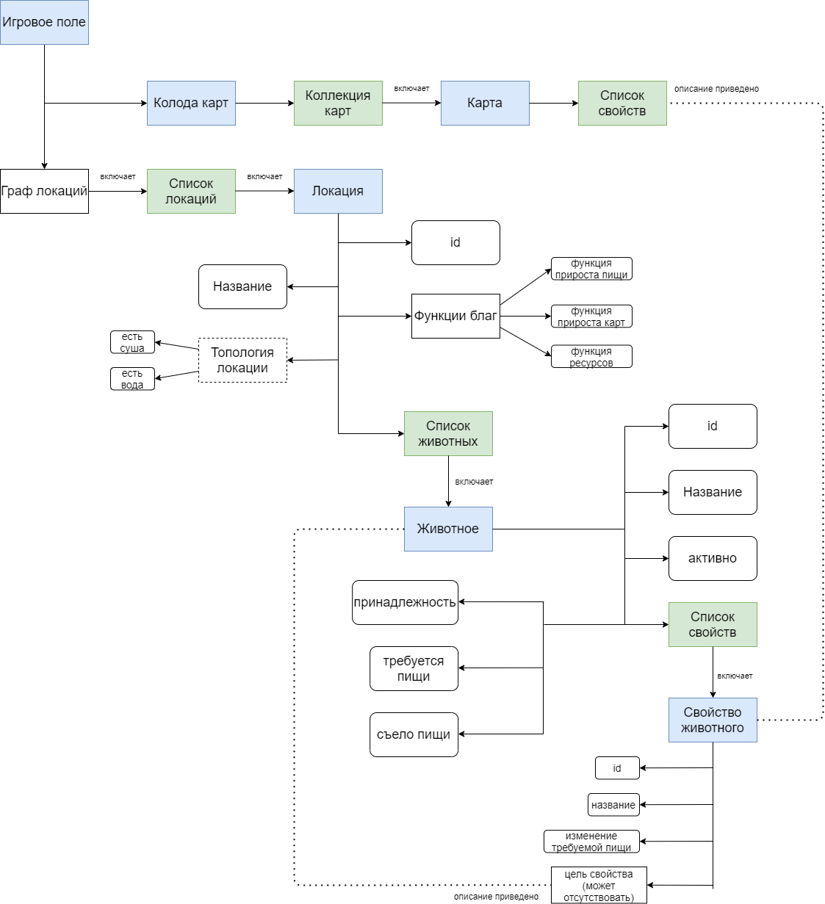

# Upgrowth project documentation

## Менеджер поля

Менеджер поля представляет интерфейс для взаимодействия с сущностью "поле" в программе.
Поле -- объект, используемый для представления игрового поля: локаций и животных в них. Локации хранят функции благ.
Структура поля:
