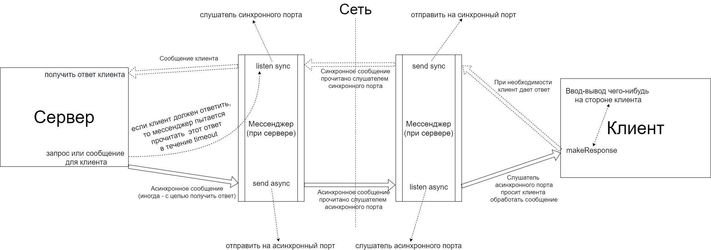

# Upgrowth project documentation

## Менеджер поля

Менеджер поля представляет интерфейс для взаимодействия с сущностью "поле" в программе. FieldManager требует для инициализации параметры,
передаваемые в объекте FieldManagerInitializer. Класс имплементирует public поля и методы, описанные в интерфейсе CoreFieldInterface и позволяющие взаимодействовать с полем:

Описание public полей:

| Поле | Содержимое |
|------|------------|
| val animals: Array<Animal> | массив со всеми животными на игровом поле |
| val players: Array<Player> | массив со всеми игроками |
| val locations: Array<Location> | массив со всеми локациями |
| val deckSize: Int | размер колоды |

Описание public методов:

| Метод | Описание |
|------|------------|
| giveCards(player: Player, number: Int) | дать игроку определенное количество карт |
| amountOfCards(player: Player, location: Location): Int | количество карт, которое должен получить игрок за данную локацию |
| addAnimal(location: Location, player: Player): Animal | создать в локации новое животное игрока и вернуть его |
| deleteAnimal(animal: Animal) | удалить животное с поля |
| moveAnimal(animal: Animal, destination: Location) | переместить животное в новую локацию |
| getLocation(animal: Animal): Location | найти локацию, в которой находится животное |
| addProperty(property: Property, animal: Animal) | добавить животному свойство |
| deleteProperty(property: Property, animal: Animal) | удалить свойство у животного |
| generateFood(location: Location) | сгенерировать еду в этой локации |
| food(location: Location): Int | количество еды в локации |
| setFood(location: Location, number: Int) | установить количество еды в локации |
| setFood(animal: Animal, number: Int) | установить количество пищи, съеденное животным (если животное не может столько съесть, установится максимальное число еды для него) |
| canMove(from: Location, to: Location): Boolean | возвращает true, если можно осуществить непосредственный переход между локациями |


### Игровое поле
Поле -- объект, используемый для представления игрового поля: колоды карт, локаций и животных в них. Локации также хранят функции благ.

Структура поля приведена ниже (элементы сомнительной целесообразности обозначены маркером недоумения "??" и сомнительным оранжевым цветом).


## Менеджмент ввода/вывода

В рамках модуля IOManager необходимо реализовать интерфейсы core.api.io.PlayerInputRequestedInterface, ServerOutputInterface,
позволяющие осуществлять связь сервера с пользователем, асинхронно отправляя ему сообщения и получая ответы. Также пользователь должен иметь
возможность асинхронно выполнять запросы к серверу, на некоторые из которых сервер должен дать ответ.

### Общие сведения о механизме ввода-вывода 

На рисунке показана схема взаимодействия сервера и клиента при отправке сервером запроса.


Каждая сторона может отправлять синхронные и асинхронные сообщения. Асинхронные сообщения -- внезапно возникающие запросы на стороне клиента или сервера 
(запрос на приостановку игры от игрока, окончание игры, запрос выбора пользователем одного из нескольких вариантов). Синхронные сообщения -- ответы
на поступивший ранее запрос (такие сообщения отправляются, если запрос требовал от другой стороны дать ответ). Таким образом -- асинхронное сообщение -- вопрос или выводимая информация,
а синхронное -- ответ на поступивший ранее запрос.

Каждая сторона выделяет по одному порту для приема синхронных и асинхронных сообщений, эти порты называются соответственно синхронный и асинхронный.
Для случая, когда клиент отправляет асинхронный запрос к серверу, схема выглядит аналогично.

Ввод-вывод на стороне клиента осуществляется через консоль.

Архитектура системы ввода/вывода приведена на рисунке ниже. 

Диспетчер игроков реализует интерфейсы PlayerInputRequestedInterface, ServerOutputInterface для вывода сообщений пользователю (PlayerInputRequestedInterface -- запросы пользовательского ввода).
Диспетчер получает на вход интерфейс PlayerInputInterface для обращений к функциям ядра. Эти обращения фактически выполняются менеджерами игроков.

Сообщения или запросы к пользователю вызывают функцию запроса для соответствующего менеджера игрока, который при помощи своего мессенджера отправляет клиенту запрос (сообщение).
На клиентской стороне работает менеджер клиента, который ожидает асинхронного сообщения от сервера при помощи своего клиентского мессенджера.

Менеджер клиента также ожидает асинхронного ввода от пользователя от объекта PlayerAsyncInput. Если менеджер получил запрос пользовательского ввода от сервера 
(пойманный клиентским мессенджером), то он запрашивает пользовательский ввод от объекта PlayerInputRequested, после чего отправляет ответ через свой мессенджер.
Если менеджер получил сообщение от сервера без запроса ввода, то он выводит его клиенту с помощью ServerOutput.

В рамках данного проекта ввод/вывод пользователя происходит с использованием консольного интерфейса.

### Messenger

Messenger -- класс, представляющий интерфейс для передачи сообщений между сервером и клиентом. В общем случае экземпляр Messenger позволяет
отправлять объекты Any вместе с признаком SendingMessageType на синхронный или асинхронный адрес пользователя, характеризуемого передаваемым в конструктор PlayerInfo.

Messenger заворачивает объект в структуру Message, подлежащую сериализации в виде JSON, дальнейшей передаче по сети и десериализации.
Messenger так же позволяет ожидать сообщения по своему синхронному или асинхронному порту.

Код Messenger:
```kotlin
class Messenger(private val myName: String) {
    private val MIN_PORT = 1024
    private val MAX_PORT = 65000

    private val mySyncPort: Int = TODO()
    private val myAsyncPort: Int = TODO()

    private val gotMessages: MutableCollection<Message> = TODO() // Пул полученных сообщений от всех источников
        // TODO сделать нормальную ссылку

    private fun checkFreePort(fp: Int): Boolean {
        return try {
            val ss = ServerSocket(fp)
            ss.close()
            true
        } catch (e: IOException) {
            false
        }
    }

    private fun getNewPort(): Int {
        // найти минимальный свободный порт. Страшный костыль, конечно, но что делать
        var i: Int = MIN_PORT
        while (i < MAX_PORT) {
            if (checkFreePort(i))
                return i
            i++
        }
        throw Exception("Can't find free port")
    }

    private fun askResponse(responseFrom: PlayerInfo, messageSync: MessageSync): Message {
        // TODO доступ к разделяемому ресурсу корректен?
        val port = when (messageSync) {
            MessageSync.ASYNC -> myAsyncPort
            MessageSync.SYNC -> mySyncPort
        }

        val res = gotMessages.find {m: Message -> m.playerName == responseFrom.name}
        if (res != null) {
            gotMessages.remove(res)
            return res
        }

        val socket: ServerSocket = ServerSocket(port)

        socket.use { socket ->
            do {
                val responseStream = BufferedReader(InputStreamReader(socket.accept().getInputStream()))
                val res = Message().toObject(responseStream.readText())
                if (res.playerName == responseFrom.name) {
                    return res
                }
                gotMessages.add(res)
            } while (true)
        }
    }

    // отправить объект obj с признаком сообщения SendingMessageType по адресу targetAddress
    fun send(obj: Any?, messageType: SendingMessageType, target: PlayerInfo, sync: MessageSync = MessageSync.ASYNC) {
        val address = when (sync) {
            MessageSync.ASYNC -> target.asyncAddress
            MessageSync.SYNC -> target.syncAddress
        }

        val socket: Socket = Socket(address.ipAddress, address.port)
        val message = Message(messageType, obj, myName)

        val toDest: Writer = OutputStreamWriter(socket.getOutputStream())
        toDest.write(message.toJson(message))
    }

    // ожидает ответа от responseFrom в течение timeout секунд
    suspend fun waitForResponse(responseFrom: PlayerInfo, timeout: Int? = 0): Any? {

        suspend fun runWaiting(): Any? = coroutineScope {

            val answerWaiter = async(Dispatchers.IO) { askResponse(responseFrom, MessageSync.SYNC) }

            if (timeout != null && timeout != 0)
                // останавливаем передачу, если истечет таймаут
                launch {
                    delay(timeout * 1000L)
                    answerWaiter.cancelAndJoin()
                }

            return@coroutineScope try {
                answerWaiter.await()
            } catch (e: CancellationException) {
                null
            }
        }

        val res = runWaiting()
        return (res as Message?)?.obj
    }

    suspend fun asyncListening(target: PlayerInfo): Message = coroutineScope {
        return@coroutineScope withContext(Dispatchers.IO) { askResponse(target, MessageSync.ASYNC) }
    }
}
```

Код Message:
```kotlin
@Serializable
class Message() {
    var type: SendingMessageType
    var obj: Any?
    var playerName: String

    init {
        type = SendingMessageType.RESUME_GAME
        obj = ""
        playerName = ""
    }

    constructor(_type: SendingMessageType, _obj: Any?, _playerName: String): this() {
        type = _type
        obj = _obj
        playerName = _playerName
    }

    fun toObject(stringValue: String): Message {
        return JSON.parse(Message.serializer(), stringValue)
    }

    fun toJson(message: Message): String {
        // Обратите внимание, что мы вызываем Serializer, который автоматически сгенерирован из нашего класса
        // Сразу после того, как мы добавили аннотацию @Serializer
        return JSON.stringify(Message.serializer(), message)
    }
}
```

### ClientManager 

ClientManager -- объект, управляющий вводом/выводом на стороне клиента. Класс позволяет перехватывать асинхронные и синхронные запросы
и формировать ответную реакцию в случае необходимости (или просто выводить присланное сообщение с помощью ServerOutput). Асинхронный запрос 
от сервера может потребовать пользовательского ввода, который получается с помощью PlayerInputRequested.

Класс содержит перехватчик асинхронных запросов от пользователя PlayerAsyncInput.

```kotlin
class ClientManager (
    val player: Player,
    private val serverInfo: PlayerInfo) {

    private val input: PlayerAsyncInput = TODO()
    private val requesterInput: PlayerInputRequested = TODO()
    private val serverOutput: ServerOutput = TODO()
    private val messenger: Messenger = Messenger(player.name)

    suspend fun run() = coroutineScope {
        launch(Dispatchers.IO) { asyncListen() } // слушать сообщения от сервера
        runAsyncInput() // слушать асинхронный ввод пользователя
    }

    // статус игры
    private suspend fun status(): Boolean {
        messenger.send("", SendingMessageType.PLAY_STATUS, serverInfo)
        return (messenger.waitForResponse(serverInfo) as Message).obj as PlayStatus == PlayStatus.IS_ON
    }

    private suspend fun runAsyncInput() {
        while (status()) {
            input.asyncMenu(this)
        }
    }

    private fun disconnect() {
        // TODO()
    }

    private suspend fun asyncListen() {
        while (status()) {
            val serverMessage = messenger.asyncListening(serverInfo)
            makeAnswer(serverMessage)
        }
    }

    private fun matchInfoMessage(infoMessage: Message) {
        when (infoMessage.obj) {
            is GameInfo -> serverOutput.printGameInfo(player.id, infoMessage.obj as GameInfo)
            is ServerMessage -> serverOutput.printMessage(infoMessage.obj as ServerMessage)
            is Array<*> -> serverOutput.updateChat(infoMessage.obj as Array<ChatEntry>)
        }
    }

    private fun makeAnswer(msg: Message) {
        when (msg.type) {
            SendingMessageType.INFO -> serverOutput.printMessage(msg.obj as ServerMessage)

            SendingMessageType.CHOOSE_ONE -> messenger.send(requesterInput.chooseOne(msg.obj as Set<*>),
                SendingMessageType.CHOOSE_ONE, serverInfo, MessageSync.SYNC)

            SendingMessageType.CHOOSE_ONE_OR_NONE -> messenger.send(
                requesterInput.chooseOneOrNone(msg.obj as Set<*>),
                SendingMessageType.CHOOSE_ONE_OR_NONE, serverInfo, MessageSync.SYNC)

            SendingMessageType.CHOOSE_SET -> messenger.send(requesterInput.chooseSet(
                    (msg.obj as ChooseCollectionParams<*>).possibilities,
                    (msg.obj as ChooseCollectionParams<*>).range.first,
                    (msg.obj as ChooseCollectionParams<*>).range.last
                ), SendingMessageType.CHOOSE_SET, serverInfo, MessageSync.SYNC)

            SendingMessageType.CHOOSE_SEQUENCE -> {} // раз нигде не используется, то и фиг с ним

            SendingMessageType.ASK_YES_NO -> messenger.send(requesterInput.yesNo(msg.obj as String),
                SendingMessageType.ASK_YES_NO, serverInfo, MessageSync.SYNC)

            SendingMessageType.ASK_STRING -> messenger.send(requesterInput.inputString(
                    (msg.obj as AskStringParams).invitation,
                    (msg.obj as AskStringParams).maxLen
                ), SendingMessageType.ASK_STRING, serverInfo, MessageSync.SYNC)

            SendingMessageType.PAUSE_GAME -> serverOutput.pauseGame(msg.obj as Int)

            SendingMessageType.RESUME_GAME -> serverOutput.resumeGame()

            SendingMessageType.END_GAME -> serverOutput.endGame()

            SendingMessageType.DISCONNECT -> disconnect()
            SendingMessageType.LEAVE -> serverOutput.leave(msg.obj as String)
        }
    }

    fun newChatEntry(message: ChatEntry){
        messenger.send(message, SendingMessageType.INFO, serverInfo)
    }

    fun requestedPause(){
        messenger.send("", SendingMessageType.PAUSE_GAME, serverInfo)
    }

    fun resumedGame(){
        messenger.send("", SendingMessageType.RESUME_GAME, serverInfo)
    }

    fun cleanExited(){
        leave()
    }

    @Deprecated("шутка")
    fun rageQuit(){
        // TODO добавить шутку
        leave()
    }

    fun disconnected(){
        messenger.send("", SendingMessageType.DISCONNECT, serverInfo)
    }

    private fun leave(){
        messenger.send(player.name, SendingMessageType.LEAVE, serverInfo)
    }
}
```


### PlayerManager

PlayerManager представляет собой интерфейс взаимодействия сервера с пользователем, предназначенный для отправки ему сообщений и получения ответов.
PlayerManager находится на серверной стороне, он содержит имя сервера для инициализации объекта Messenger, информацию об игроке, менеджером которого является данный объект, а так же 
ссылку на интерфейс PlayerInputInterface, полученную от ядра.

При помощи PlayerInputInterface PlayerManager может выполнять асинхронные запросы к ядру (поступающие от ClientManager).

Класс содержит функции, почти совпадающие с функциями PlayerInputRequestedInterface и ServerOutputInterface (его функции не принимают объект Player).
```kotlin
class PlayerManager(
    private val serverName: String, // имя сервера
    val playerInfo: PlayerInfo, // информация об игроке, менеджером которого является данный объект
    private val player: Player,
    private val playerInput: PlayerInputInterface
) {
    private val messenger: Messenger = Messenger(serverName)

    private suspend fun asyncListen() {
        while (playerInput.getPlayStatus() == PlayStatus.IS_ON) {
            val clientMessage = messenger.asyncListening(playerInfo)
            makeAnswer(clientMessage)
        }
    }

    private fun makeAnswer(msg: Message) {
        // ответить на сообщение
        when(msg.type) {
            SendingMessageType.PLAY_STATUS -> messenger.send(
                playerInput.getPlayStatus(),
                SendingMessageType.PLAY_STATUS,
                playerInfo, MessageSync.SYNC)

            SendingMessageType.PAUSE_GAME -> playerInput.requestedPause(player)

            SendingMessageType.RESUME_GAME -> playerInput.requestedPause(player)

            SendingMessageType.DISCONNECT -> playerInput.disconnected(player)

            SendingMessageType.LEAVE -> playerInput.cleanExited(player)
        }
    }

    suspend fun <T> chooseOne(possibilities: Set<T>, timeout: Int): T {
        messenger.send(possibilities, SendingMessageType.CHOOSE_ONE, playerInfo)
        return messenger.waitForResponse(playerInfo, timeout) as T
    }

    suspend fun <T> chooseOneOrNone(possibilities: Set<T>, timeout: Int): T? {
        messenger.send(possibilities, SendingMessageType.CHOOSE_ONE_OR_NONE, playerInfo)
        return messenger.waitForResponse(playerInfo, timeout) as? T
    }

    suspend fun <T> chooseSet(
        possibilities: Set<T>,
        timeout: Int,
        minNumber: Int,
        maxNumber: Int
    ): Set<T> {
        messenger.send(ChooseCollectionParams<T>(possibilities, minNumber..maxNumber),
            SendingMessageType.CHOOSE_SET, playerInfo)
        return messenger.waitForResponse(playerInfo, timeout) as Set<T>
    }

    suspend fun <T> chooseSequence(
        possibilities: Set<T>,
        timeout: Int,
        minNumber: Int,
        maxNumber: Int
    ): Array<T> {
        messenger.send(ChooseCollectionParams<T>(possibilities, minNumber..maxNumber),
            SendingMessageType.CHOOSE_SEQUENCE, playerInfo)
        return messenger.waitForResponse(playerInfo, timeout) as Array<T>
    }

    suspend fun yesNo(invitation: String, timeout: Int): PlayerAnswers {
        messenger.send(invitation, SendingMessageType.ASK_YES_NO, playerInfo)
        return messenger.waitForResponse(playerInfo, timeout) as PlayerAnswers
    }

    suspend fun inputString(invitation: String, maxLength: Int): String {
        messenger.send(AskStringParams(invitation, maxLength), SendingMessageType.ASK_STRING, playerInfo)
        return messenger.waitForResponse(playerInfo) as String
    }

    fun sendGameInfo(gameInfo: GameInfo) {
        messenger.send(gameInfo, SendingMessageType.INFO, playerInfo)
    }

    fun updateChat(chat: Array<ChatEntry>) {
        messenger.send(chat, SendingMessageType.INFO, playerInfo)
    }

    fun sendMessage(message: ServerMessage) {
        messenger.send(message, SendingMessageType.INFO, playerInfo)
    }

    fun pauseGame(timeout: Int?) {
        messenger.send(timeout!!, SendingMessageType.PAUSE_GAME, playerInfo)
    }

    fun resumeGame() {
        messenger.send("", SendingMessageType.RESUME_GAME, playerInfo)
    }

    fun endGame() {
        messenger.send("", SendingMessageType.END_GAME, playerInfo)
    }
}
```

### PlayersDispatcher

Класс реализует интерфейсы для взаимодействия ядра и пользователя. Класс позволяет выводить игрокам сообщения, посылать асинхронные запросы
пользовательского ввода. Класс содержит коллекцию объектов PlayerManager. Асинхронный ввод пользователей выполняется в PlayerManager.
Синхронный ответ пользователю так же реализован в PlayerManager.

Функциональность класса реализована следующим образом: выполняется поиск PlayerManager, для которого (которых) следует выполнить асинхронный запрос,
после чего для него (для них) выполняется соответствующий запрос.

```kotlin
class PlayersDispatcher(serverName: String,
                        playerInfs: Array<Pair<PlayerInfo, Player>>,
                        private val playerInput: PlayerInputInterface
):
    PlayerInputRequestInterface, ServerOutputInterface {

    override var defaultTimeout: Int = 5
    override var player: Player = TODO() // чё
    override var timeOut: Int = defaultTimeout

    private val playerManagers: Collection<PlayerManager> =
        List(playerInfs.size) { i -> PlayerManager(serverName, playerInfs[i].first, playerInfs[i].second, playerInput) }

    private fun findManager(actor: Player): PlayerManager {
        return playerManagers.find { pm -> pm.playerInfo.playerId == actor.id } !!
    }

    override suspend fun <T> chooseOne(possibilities: Set<T>, actor: Player, timeout: Int): T {
        return findManager(actor).chooseOne(possibilities, timeout)
    }

    override suspend fun <T> chooseOneOrNone(possibilities: Set<T>, actor: Player, timeout: Int): T? {
        return findManager(actor).chooseOneOrNone(possibilities, timeout)
    }

    override suspend fun <T> chooseSet(
        possibilities: Set<T>,
        actor: Player,
        timeout: Int,
        minNumber: Int,
        maxNumber: Int
    ): Set<T> {
        return findManager(actor).chooseSet(possibilities, timeout, minNumber, maxNumber)
    }

    override suspend fun <T> chooseSequence(
        possibilities: Set<T>,
        actor: Player,
        timeout: Int,
        minNumber: Int,
        maxNumber: Int
    ): Array<T> {
        return findManager(actor).chooseSequence(possibilities, timeout, minNumber, maxNumber)

    }

    override suspend fun yesNo(actor: Player, invitation: String, timeout: Int): PlayerAnswers {
        return findManager(actor).yesNo(invitation, timeout)
    }

    override suspend fun inputString(actor: Player, invitation: String, maxLength: Int): String {
        return findManager(actor).inputString(invitation, maxLength)
    }

    override fun sendGameInfo(destination: Player, gameInfo: GameInfo) {
        findManager(destination).sendGameInfo(gameInfo)
    }

    override fun updateChat(chat: Array<ChatEntry>) {
        playerManagers.forEach {pm -> pm.updateChat(chat)}
    }

    override fun sendMessage(destination: Player, message: ServerMessage) {
        findManager(destination).sendMessage(message)
    }

    override fun pauseGame(timeout: Int?) {
        playerManagers.forEach {pm -> pm.pauseGame(timeout)}
    }

    override fun resumeGame() {
        playerManagers.forEach {pm -> pm.resumeGame()}
    }

    override fun endGame() {
        playerManagers.forEach {pm -> pm.endGame()}
    }
}
```

### Вспомогательные классы и интерфейсы

| Класс/интерфейс | Описание |
|------|------------|
| interface ServerOutput | Вывод сообщений от сервера |
| interface PlayerInputRequested | Запрос пользовательского ввода от сервера |
| class PlayerAsyncInput | Асинхронный ввод пользователя |

### enum и data классы

```kotlin
data class PlayerInfo(
    val playerId: Int,
    val name: String,
    val syncAddress: PlayerAddress,
    val asyncAddress: PlayerAddress
)

fun serverInfo(syncAddress: PlayerAddress, asyncAddress: PlayerAddress): PlayerInfo {
    return PlayerInfo(-1, "SERVER", syncAddress, asyncAddress)
}

data class PlayerAddress(
    val ipAddress: String,
    val port: Int
)

data class ChooseCollectionParams<T>(
    val possibilities: Set<T>,
    val range: IntRange
)

data class AskStringParams(
    val invitation: String,
    val maxLen: Int
)

enum class SendingMessageType {
    INFO, CHOOSE_ONE, CHOOSE_ONE_OR_NONE, CHOOSE_SET, CHOOSE_SEQUENCE, ASK_YES_NO, ASK_STRING, PLAY_STATUS,
    PAUSE_GAME, RESUME_GAME, END_GAME, DISCONNECT, LEAVE
}

enum class MessageSync {
    ASYNC, SYNC
}
```